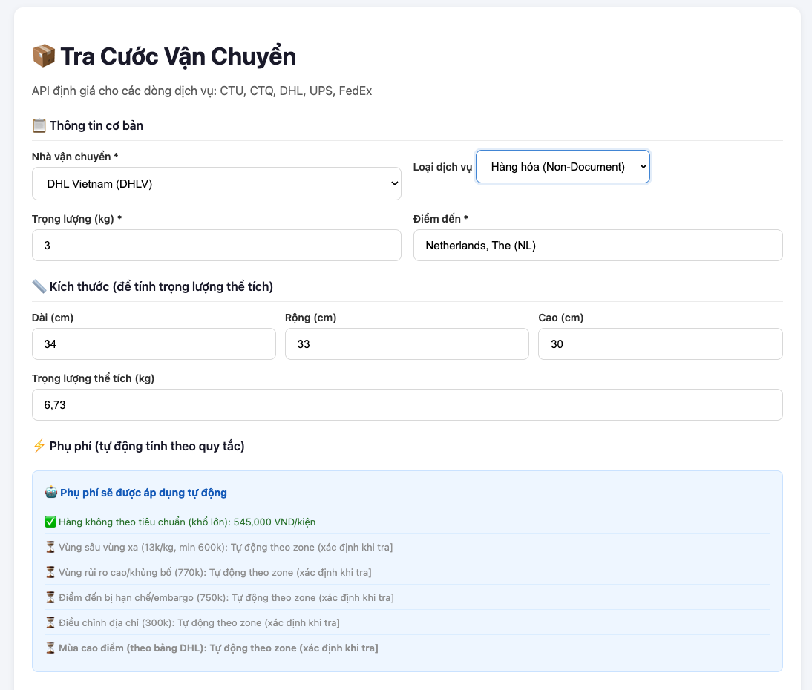
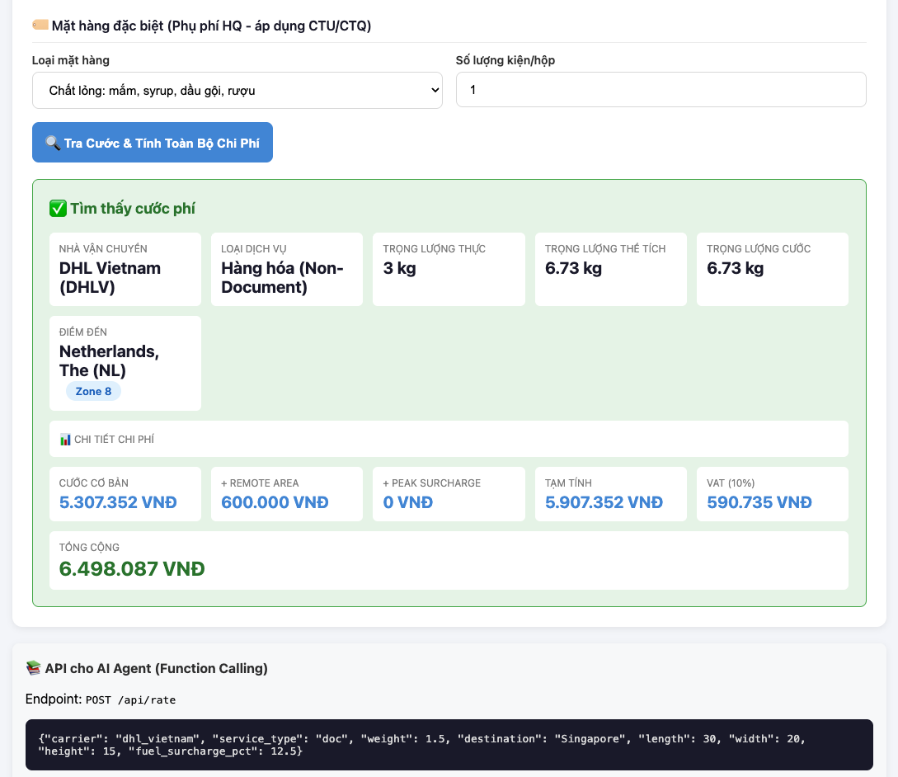

# ShipCost - Multi-Carrier Shipping Rate Calculator

Hệ thống tra cước vận chuyển đa hãng: **CTU, CTQ, DHL Singapore, DHL Vietnam, UPS Saver, FedEx**

## Demo

| Form tra cước | Kết quả |
|--------------|---------|
|  |  |

## Tính năng

- ✅ **Web Form** - Tra cước thủ công tại `http://localhost:8000`
- ✅ **REST API** - Cho AI Agent gọi function calling tại `POST /api/rate`
- ✅ **Tự động tính phụ phí** - Không cần nhập thủ công:
  - Quá trọng >70kg (2.435M VNĐ)
  - Quá khổ >100cm (545K VNĐ)
  - Khổ lớn (thể tích > 1.5x trọng lượng thực)
  - Vùng sâu/xa DHL (tự động theo zone)
  - Vùng rủi ro cao/embargo (tự động theo quốc gia)
  - Mùa cao điểm (flag)
  - Mặt hàng đặc biệt HQ (CTU/CTQ)
- ✅ **Tính thể tích** - L×W×H/5000 lấy max(trọng lượng thực, thể tích)
- ✅ **6 hãng vận chuyển** - CTU, CTQ, DHL Sing, DHL VN, UPS Saver, FedEx

---

## Cài đặt

### Yêu cầu
- Python 3.11+
- pip

### 1. Clone & cài đặt thư viện
```bash
cd shipcost
pip install fastapi uvicorn pydantic openpyxl
```

### 2. Chạy server
```bash
python api_server.py
```

### 3. Truy cập
- **Web Form**: http://localhost:8000
- **API Docs**: http://localhost:8000/docs
- **API Health**: http://localhost:8000/api/health

---

## Sử dụng API (cho AI Agent)

### Endpoint chính
```
POST http://localhost:8000/api/rate
Content-Type: application/json
```

### Request
```json
{
  "carrier": "dhl_vietnam",
  "service_type": "doc",
  "weight": 1.5,
  "destination": "Singapore",
  "length": 30,
  "width": 20,
  "height": 15,
  "item_category": "nuoc_hoa_son_mong",
  "item_quantity": 3
}
```

| Field | Bắt buộc | Mô tả |
|-------|----------|-------|
| carrier | ✅ | `ctu`, `ctq`, `dhl_sing`, `dhl_vietnam`, `ups_saver`, `fedex` |
| service_type | ❌ | `doc`, `non_doc`, `document`, `non_document`, `envelope`, `pak`, `ip`, `parcel` |
| weight | ✅ | Trọng lượng (kg) |
| destination | ✅ | Tên quốc gia (phải khớp zone data) |
| length/width/height | ❌ | Kích thước (cm) - để tính thể tích |
| item_category | ❌ | Loại hàng HQ (chỉ CTU/CTQ) |
| item_quantity | ❌ | Số lượng kiện (mặc định 1) |

### Response
```json
{
  "carrier": "dhl_vietnam",
  "service_type": "doc",
  "weight": 1.5,
  "destination": "Singapore",
  "zone": "Zone 1",
  "base_rate": 1386606.4,
  "volumetric_weight": 1.8,
  "chargeable_weight": 1.8,
  "surcharges": {
    "fuel_surcharge": 207990.96,
    "peak_surcharge": 0
  },
  "subtotal": 1594597.36,
  "vat": 159459.74,
  "total_vnd": 1754057.10,
  "found": true
}
```

---

## Các endpoint khác

| Endpoint | Mô tả |
|----------|-------|
| `GET /api/carriers` | Danh sách hãng & dịch vụ |
| `GET /api/countries/{carrier}` | Danh sách quốc gia/zones |
| `GET /api/zone/{carrier}?destination={country}` | Tra zone của quốc gia |
| `GET /api/surcharges/{carrier}` | Bảng phụ phí |

---

## Cập nhật dữ liệu từ Excel

Khi file Excel thay đổi:

```bash
python extract_pricing.py  # Đọc Excel → ghi pricing_data.json
python api_server.py       # Restart server để load dữ liệu mới
```

File nguồn: `BẢNG GIÁ NEWPOST PUPLIC KHÁCH HÀNG.xlsx` (file gốc, không commit lên repo)

---

## Cấu trúc thư mục
```
shipcost/
├── api_server.py          # FastAPI server
├── index.html             # Web form
├── extract_pricing.py     # Script extract Excel → JSON
├── pricing_data.json      # Dữ liệu giá (1.2MB)
├── pricing_data.xlsx      # File Excel gốc (không commit)
├── PROJECT_SUMMARY.md     # Tóm tắt dự án
└── README.md              # File này
```

---

## Troubleshooting

| Lỗi | Nguyên nhân | Khắc phục |
|-----|-------------|-----------|
| `address already in use` | Port 8000 đang chạy | `lsof -i :8000 \| awk 'NR>1 {print $2}' \| xargs kill -9` |
| `Zone not found` | Tên quốc gia không khớp | Kiểm tra `GET /api/countries/{carrier}` |
| `Failed to fetch` | Server không chạy | Kiểm tra `curl http://localhost:8000/api/health` |
| `ModuleNotFoundError` | Thiếu thư viện | `pip install fastapi uvicorn pydantic openpyxl` |

---

## License
MIT License - Free to use and modify